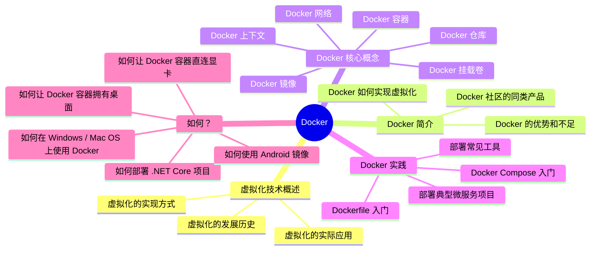
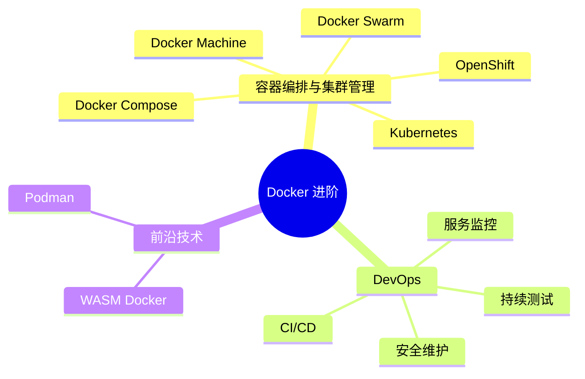

# Docker 学习路线

```mermaid
mindmap
    root((Docker))
        虚拟化技术概述
            虚拟化的发展历史
            虚拟化的实现方式
            虚拟化的实际应用
        Docker 简介
            Docker 如何实现虚拟化
            Docker 的优势和不足
            Docker 社区的同类产品
        Docker 核心概念
            Docker 镜像
            Docker 容器
            Docker 仓库
            Docker 上下文
            Docker 网络
            Docker 挂载卷
        Docker 实践
            Dockerfile 入门
            Docker Compose 入门
            部署常见工具
            部署典型微服务项目
        如何？
            如何在 Windows / Mac OS 上使用 Docker
            如何部署 .NET Core 项目
            如何让 Docker 容器直连显卡
            如何使用 Android 镜像
            如何让 Docker 容器拥有桌面
```

下面是进阶部分：

```mermaid
mindmap
    root((Docker 进阶))
        容器编排与集群管理
            Docker Machine
            Docker Compose
            Docker Swarm
            Kubernetes
            OpenShift
        DevOps
            CI/CD
            服务监控
            持续测试
            安全维护
        前沿技术
            WASM Docker
            Podman
```
