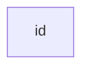
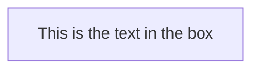

# Mermaid 流程图

[[TOC]]

## 基本语法

所有的流程图都是由节点、几何图形和边、箭头或线条组成。美人鱼代码定义了这些节点和边的构成和互动方式。

它还可以容纳不同的箭头类型，多方向的箭头，以及链接到子图和从子图的链接。

重要提示：不要把 "结束 " 一词作为流程图的节点来输入。将所有或任何一个字母大写，以保持流程图不被破坏，即 "结束 "或 "END"。或者你可以应用这个变通方法。

### 普通结点

### 带有文本的结点

也可以在框中设置与id不同的文本。如果这样做了几次，将使用为该节点找到的最后一个文本。另外如果你以后为节点定义边，可以省略文本定义。渲染盒子时将使用之前定义的那个。

## 图表

## 流程图方向

## 节点形状

## 节点之间的链接

## 打破语法的特殊字符

## 子图

## 流程图

## 子图中的方向

## 相互作用

## 样式和类

## 对fontawesome的基本支持

## 图形声明在顶点和链接之间有空格，没有分号

## 配置
