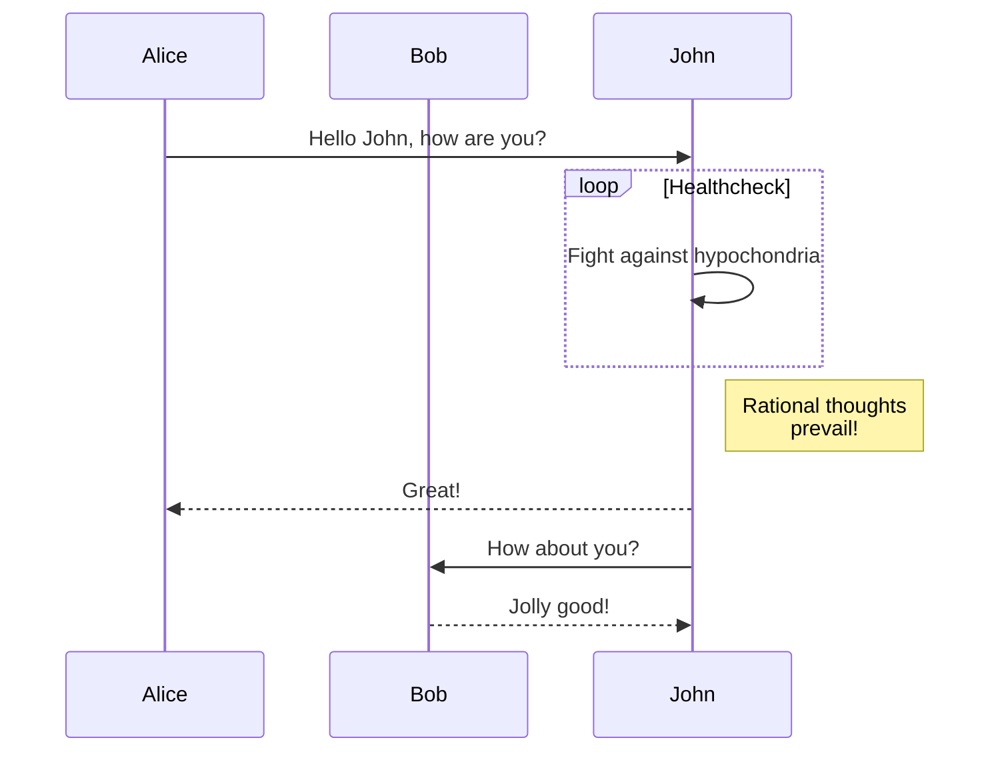
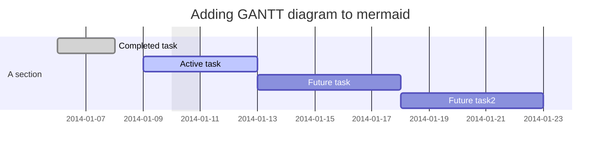
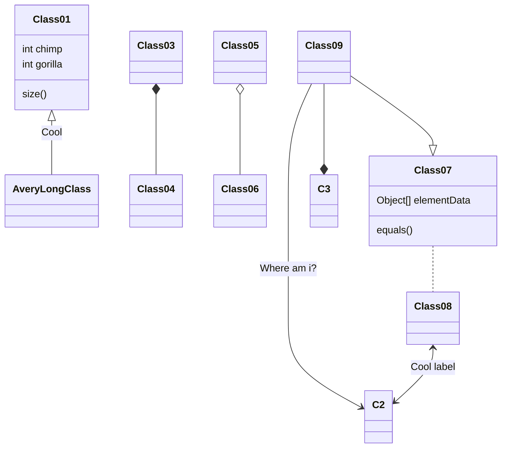
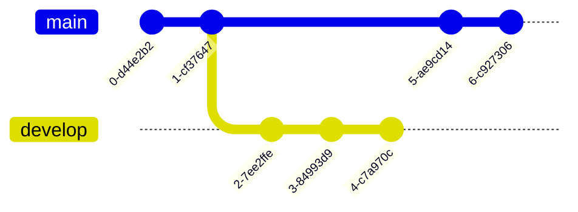
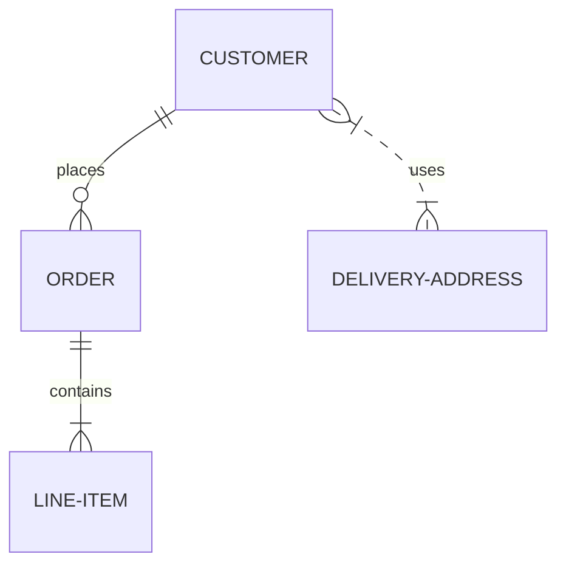
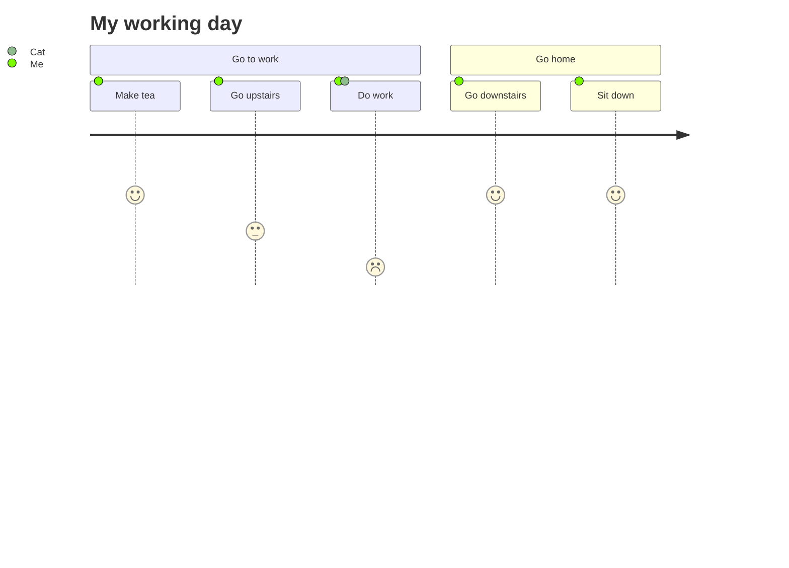
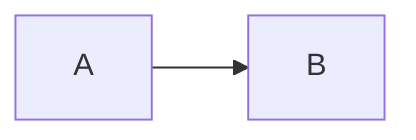

# Mermaid 简介

[[TOC]]

## 1. 什么是 Mermaid

[Mermaid](https://mermaid.js.org/) 允许你使用文本和代码创建图表和可视化。

它是一个基于 JavaScript 的制图和图表工具，可以渲染受 Markdown 启发的文本定义，动态地创建和修改图表。

如果你熟悉 Markdown，那么学习 Mermaid 的语法应该没有问题。

这里还有一个官方的 [在线 Mermaid 编辑器](https://mermaid.live/edit)，你可以在这里尝试 Mermaid 的语法。它还提供了更换主题、导出 SVG 等功能。

Mermaid 是一个基于 JavaScript 的图表工具，它使用 Markdown 启发的文本定义和一个渲染器来创建和修改复杂的图表。Mermaid 的主要目的是帮助文档赶上开发。

绘制图表和文档要花费开发人员宝贵的时间，而且很快就会过时。但是，没有图表或文档会破坏生产力，损害组织学习。

Mermaid 通过使用户能够创建易于修改的图表来解决这个问题，它也可以成为生产脚本（和其他代码片段）的一部分。

## 2. 示例图表

### 2.1 流程图


### 2.2 序列图




### 2.3 Gantt 图




### 2.4 类图




### 2.5 Git 图




### 2.6 ER 图




### 2.7 用户旅程图




## 3. 文档写作指南

如果你需要实际表达 Mermaid 图表，可以直接使用反引号包裹的代码块表示：

````markdown

````


如果你需要展示代码，可以配合 `@vuepress/plugin-shiki` 插件，将任意名称标注在 `mermaid:` 的后面即可得到代码块而不是图表。

````markdown

````


