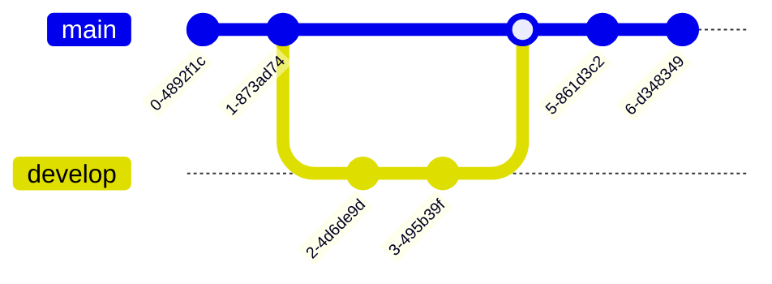

# Mermaid Git 图

[[TOC]]

Git 图形是不同分支上的 Git 提交和 Git 操作（命令）的图形化表示。

这类图表对开发者和开发团队分享他们的 Git 分支策略特别有帮助。例如，它使人们更容易直观地了解 Git 流程的工作原理。

Mermaid可以渲染Git图

```text
gitGraph
   commit
   commit
   branch develop
   checkout develop
   commit
   commit
   checkout main
   merge develop
   commit
   commit
```


在 Mermaid 中，我们支持基本的 Git 操作：
- `commit`：表示在当前分支上的一个新的提交
- `branch`：创建并切换到一个新的分支，将其设置为当前分支
- `checkout`：签出一个现有的分支，并将其设置为当前分支
- `merge`：将一个现有的分支合并到当前分支上

在这些关键的 Git 命令的帮助下，你将能够在 Mermaid 中非常容易和快速地绘制一个 Git 图。实体名称通常是大写的，尽管在这方面没有公认的标准，而且在 Mermaid 中也没有要求。
