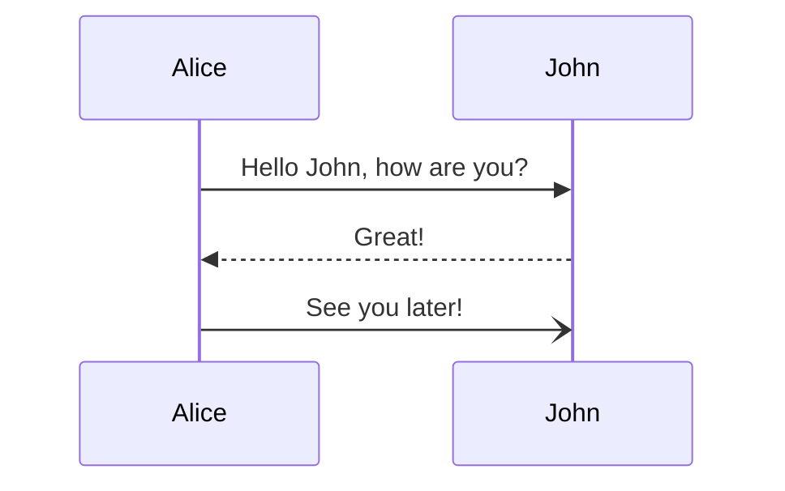
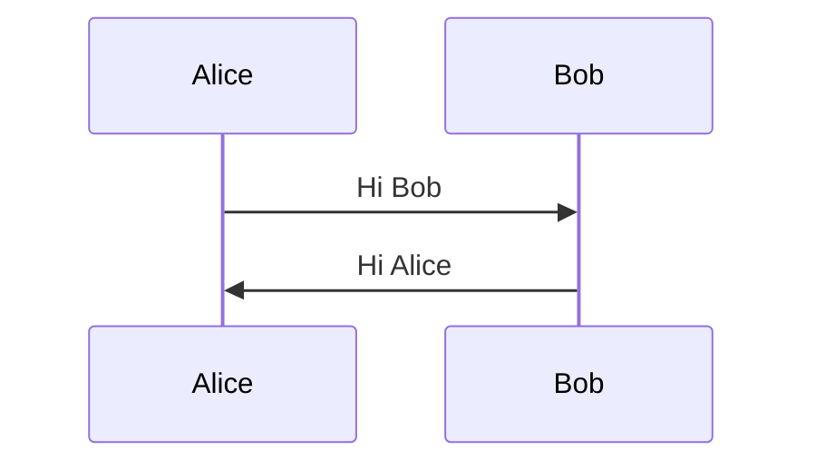
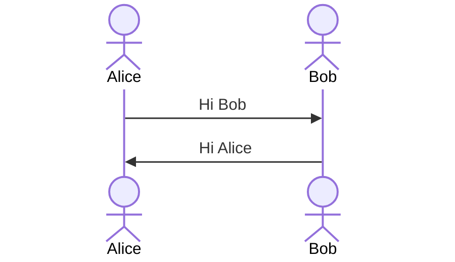
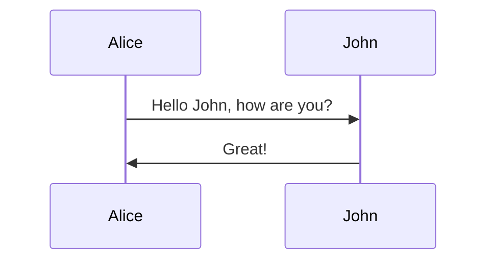
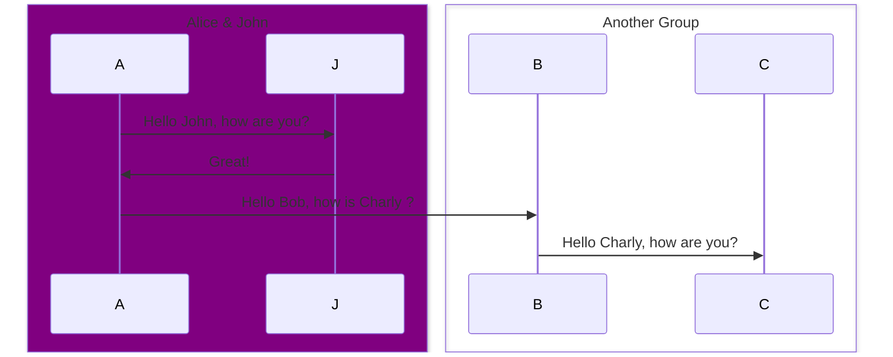
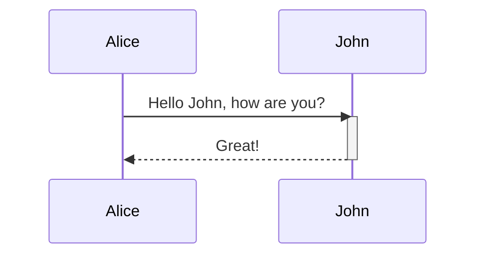
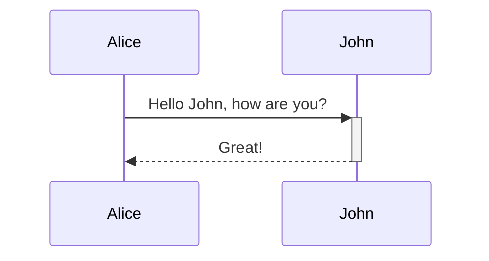
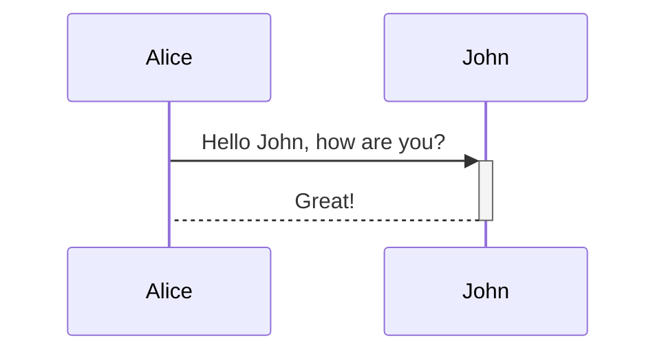
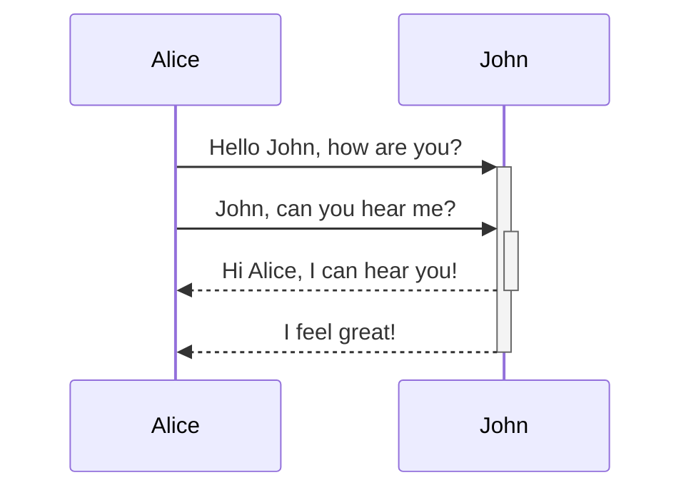

# Mermaid 时序图

[[TOC]]

## 1. 时序图介绍

**时序图**（Sequence Diagram）又名序列图、循序图，是一种 UML 交互图。它通过描述对象之间发送消息的时间顺序显示多个对象之间的动态协作。它可以表示用例的行为顺序，当执行一个用例行为时，其中的每条消息对应一个类操作或状态机中引起转换的触发事件。[^1]

[^1]: 时序图，百度百科，<https://baike.baidu.com/item/%E6%97%B6%E5%BA%8F%E5%9B%BE/3659178>



时序图中包括如下元素：角色，对象，生命线，控制焦点和消息。

1. **角色**（Actor）：系统角色，可以是人或者其他系统，子系统。
2. **对象**（Object）：对象是类的实例，以一个矩形表示，位于时序图的顶部的对象是类角色。对象有三种状态：激活、运行（存在）和销毁，对象一般命名方式如下：
    1. 包含对象名和类名
    2. 只显示类名不显示对象名，即为一个匿名对象
    3. 只显示对象名不显示类名
3. **生命线**（Lifeline）：生命线代表时序图中的对象在一段时期内的存在。时序图中每个对象和底部中心都有一条垂直的虚线，这就是对象的生命线，对象间的消息存在于两条虚线间。
4. **控制焦点**（Activation）：控制焦点代表时序图中的对象执行一项操作的时期，在时序图中每条生命线上的窄矩形代表活动期。
5. **消息**（Message）：消息是定义交互和协作中交换信息的类，用于对实体间的通信内容建模，信息用于在实体间传递信息。允许实体请求其他的服务，类角色通过发送和接受信息进行通信。

## 2. Mermaid 时序图语法

::: info 关键字

如果节点使用 `end` 命名可能导致绘图中断，因此，应该尽可能使用引号（`""`）或括号（`[] {} ()`）来包裹 `end` 这个词。

:::

### 2.1 参与者


参与者（Participants）一般是对象，可以隐式定义，如上面的例子。默认按照图表源文本中的出现顺序呈现的。如果需要定义顺序可用用下面的语法：




### 2.2 角色

如果你特别想使用角色（Actor）符号而不是矩形，你可以通过使用角色语句（`actor ..`）来实现，如下图所示。




### 2.3 别名

别名语句（`.. as ..`）可以用简短标志表示一个标签。




### 2.4 组

组的语法是

```mermaid:@vuepress/plugin-shiki
box [color] [title]
    ...
end
```

其中 `color` 可以是 `transparent` 或 `rgb(33,66,99)` 所表示的演示，也可以使用 CSS 的关键字颜色。如果 `title` 的内容和颜色名称冲突可以使用 `transparent` 表示无颜色。




### 2.5 消息

消息的语法如下：

```mermaid:@vuepress/plugin-shiki
[Actor][Arrow][Actor]: Message text
```

| 箭头   | 描述                         |
| ------ | ---------------------------- |
| `->`   | 无箭头的实线                 |
| `-->`  | 无箭头的虚线                 |
| `->>`  | 带箭头的实线                 |
| `-->>` | 带箭头的虚线                 |
| `-x`   | 末端有十字的实线             |
| `--x`  | 末端有十字的虚线             |
| `-)`   | 末端有开放箭头的实线（异步） |
| `--)`  | 末端有开放箭头的虚线（异步） |




为了简化 `activate ..` 语句，可以使用 `+` / `-` 来表示消息的开始结束。





消息可以叠加：




