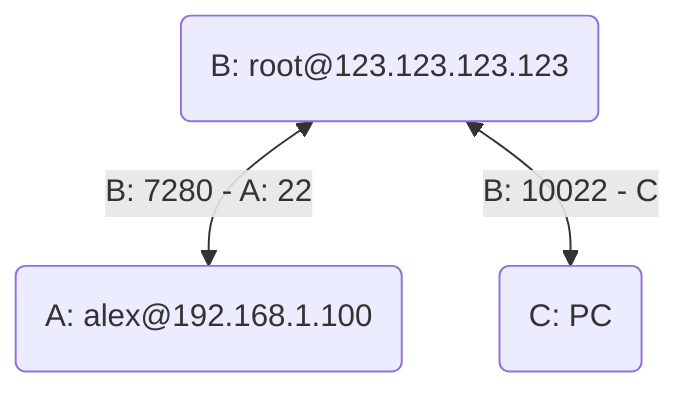

# SSH 反向代理

## 1. 问题描述

假设当前有一种需求，需要一台机器通过 SSH 连接另一台非公网的机器，而此时可提供一台公网机器作为代理。



将 A 作为 B 机器的反向代理，在 B 机器上进行代理转发即可。B 暴露 7280 端口用于与 A 通信，同时 B 暴露 10022 端口用于与 C 通信。

::: info 远程服务器防火墙

确保远程服务器的防火墙已经允许上述两个端口。

建议：B 机器创建一个用户仅用于代理，而不是使用 root 用户。

:::

所需 SSH 命令参数是：
- `-f`：后台执行 SSH 命令
- `-C`：允许压缩数据
- `-N`：不执行远程命令
- `-R`：将远程主机的端口转发到本地指定端口
- `-L`：将本地的某个端口转发到远程主机的端口
- `-p`：指定端口

## 2. 内网主机配置

```bash
ssh -fCNR [B的IP或空]:[B的端口]:[A的IP]:[A的端口] [B的用户名]@[B的IP]
```

示例：

```bash
ssh -fCNR 7280:localhost:22 root@123.123.123.123
```

## 3. 远程主机配置

```bash
ssh -fCNL [A的IP或空]:[A的端口]:[B的IP]:[B的端口] [B的用户名]@[B的IP]
```

示例：

```bash
ssh -fCNL *:10022:localhost:7280 localhost
```

此外，最好给 A 添加自动登录配置，在内网的 A 机器上执行：

```bash
ssh-copy-id alex@123.123.123.123 -p 10022
```

在 A 机器上使用下面的命令来测试是否能自动登录：

```bash
ssh root@123.123.123.123
```

如果登录成功则通过。

## 4. 测试连接

如果需要检查各自机器上的 SSH 服务，可以通过下面的命令检查：

```bash
ps -aux | grep ssh
```

现在连接服务器测试：

```bash
ssh -p 10022 alex@123.123.123.123
```

## 5. 使用 autossh 建立稳定隧道

SSH 在网络中断时会丢失连接，为了能稳定连接，我们需要安装 `autossh`：

::: code-tabs

@tab Ubuntu/Debian

```bash
sudo apt install autossh
```

@tab CentOS/RedHat

```bash
sudo yum install autossh
```

:::

使用指令：

```bash
autossh -M 7281 -fCNR 7280:localhost:22 root@123.123.123.123
```

端口 7281 用于监听 SSH 状态，如果失败则重新连接。也需要防火墙允许此端口。

现在将此命令设置为开机自动启动即可。

不过机器 A 上的命令也需要自动启动才能保证稳定，如果机器 B 不能稳定运行，也需要此时机器 A 安装 `autossh`，并使用下面的命令：

```bash
autossh -M 7281 -fN \
    -o "PubkeyAuthentication=yes" \
    -o "StrictHostKeyChecking=false" \
    -o "PasswordAuthentication=no" \
    -o "ServerAliveInterval 60" \
    -o "ServerAliveCountMax 3" \
    -R 123.123.123.123:7280:localhost:22 \
    root@123.123.123.123
```
